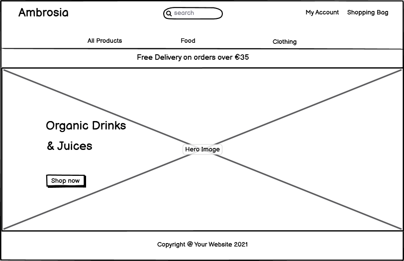
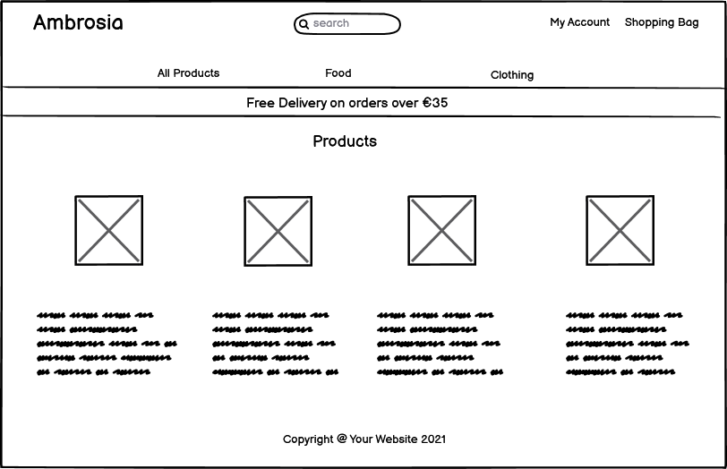
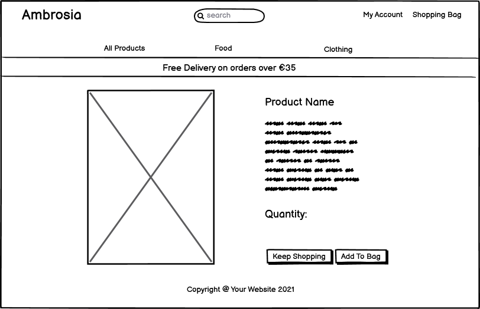

# ** **
[View the live project here.]()

This is a e-commerce website

## **User Experience (UX)**
* ### **User stories**
[View the User Stories here](https://docs.google.com/spreadsheets/d/15B0v0q7f93ZdcNREwMQn1jGTd3TQnubUqgNnKLBegZ4/edit#gid=0)
       
* ### **Design**
    * **Colour Scheme**
        - Two colours used for the site- primary colour is white, secondary is green.
        
    * **Typography**
        - The Montserrat Alternates and Open Sans fonts were used at website with Sans Serif as the fallback font, in case chosen fonds are not imported correctly. The Sans Serif is the main font, Montserrat Alternates was used for website logo. Both of chosen fonts look attractive and easy to read.
    * **Imagery**
        - The large background image is designed to catch the user's eye.

* ### **Wireframes**
    * **Home Page** 
    

    * **Product Page** 
    

    * **Single Product Page** 
    

## **Features**
* **Responsive on all device sizes**
* **Interactive elements**
* **Notification system**
* **Persistent storage: create, read, update and delete.**
* **Security**
- Security was provided by Django and decorators such as @login_required and @post_required
* **Search options**
* **Simplicity**
* **Good image resolution**
* **Speed**
* **Flexibility**

## **Technologies Used**
### **Languages Used**
* [HTML5](https://en.wikipedia.org/wiki/HTML5)
* [CSS3](https://en.wikipedia.org/wiki/CSS)
* [JavaScript](https://en.wikipedia.org/wiki/JavaScript)
* [Python](https://wiki.python.org/moin/)
### **Frameworks, Libraries & Programs Used**
1. [Balsamiq](https://balsamiq.com/)
    - Balsamiq was used to design wireframes.
2. [Bootstrap](https://getbootstrap.com/)
    - Bootstrap was used to create responsive, stylish website and to navigate it easly.
3. [Google Fonts](https://fonts.google.com/)
    - Google Fonts were used to import chosen fonts into css file.
4. [Font Awesome](https://fontawesome.com/)
    - Font Awesome was used to import vector and social icons for style and identification purposes.
5. [Git](https://git-scm.com/)
    - Git was used as a version-control system for coding, tracking changes, commit to Git and push to GitHub.
6. [GitHub](https://github.com/)
    - GitHub was used to store all project code with everyday changes.
7. [jQuery](https://jquery.com/)
    - jQuery was used with Materialize to make the navbar and other components responsive but was also used for the smooth scroll function in JavaScript.
8. [Heroku](https://heroku.com/)
    - Heroku platform was used to deploy, run, and operate app entirely in the cloud.

## **Testing**
- W3C Markup Validator

- W3C CSS Validator

- Lighthouse report

### **Testing User Stories from User Experience (UX) Section**

### **Further Testing**
### **Known Bugs**

## **Deployment**
### **Heroku**

## **Credits**
### **Code**
- My project is based on Boutique Ado Tutorial. Python, JavaScript, CSS and HTML code were copied from it and changed a little for my app's needs.
- Bootstrap HTML, CSS and JavaScript code was used for a modern responsive front-end.
- A modal popup HTML, CSS and JavaScript code was taken from [W3schools](https://www.w3schools.com/howto/howto_css_modals.asp).

### **Content**

### **Media**
- The Front Page Image were obtained from [Unsplash.com](https://unsplash.com/photos/tTHIC3uO6Ng).
### **Acknowledgements**
- My Mentor for continuous helpful feedback, ideas and support.
- Tutor support at Code Institute for their support.
