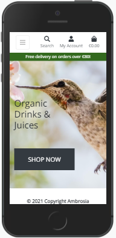
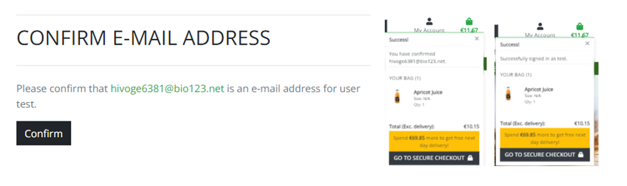

# **Ambrosia**
[View the live project here.](https://ambrosia-main.herokuapp.com/)

This is an e-commerce website which sales organic drinks, juices and clothing.

## **User Experience (UX)**
* ### **User stories**

       
* ### **Design**
    * **Colour Scheme**
        - Two colours used for the site- primary colour is white, secondary is green.
        
    * **Typography**
        - The Montserrat Alternates and Open Sans fonts were used at website with Sans Serif as the fallback font, in case chosen fonds are not imported correctly. The Sans Serif is the main font, Montserrat Alternates was used for website logo. Both of chosen fonts look attractive and easy to read.
    * **Imagery**
        - The large background image is designed to catch the user's eye.

* ### **Wireframes**
    * **Home Page** 
    

    * **Product Page** 
    

    * **Single Product Page** 
    

## **Features**
* **Responsive on all device sizes**
    - iPhone 5/SE

    

    - iPad

    

    - iPad Pro

    

    - Desktop

    
* **Interactive elements**
    - The shoppers in this e-commerce website, could add, update, remove products and adjust the shopping bag.
* **Notification system**
    - Success, alert and error messages are provided for many of shopper's actions.
* **Persistent storage: create, read, update and delete.**
    - Heroku Postgres and AWS S3 were used to store data for this project.
* **Security**
    - Security was provided in Django allauth, by decorators such as @login_required and csrf_token which's included by default with each new project.
* **Search options**
    - A Site User can search a product by their name or description.
* **Simplicity**
* **Good image resolution**
* **Speed**
* **Flexibility**

## **Technologies Used**
### **Languages Used**
* [HTML5](https://en.wikipedia.org/wiki/HTML5)
* [CSS3](https://en.wikipedia.org/wiki/CSS)
* [JavaScript](https://en.wikipedia.org/wiki/JavaScript)
* [Python](https://wiki.python.org/moin/)
### **Frameworks, Libraries & Programs Used**
1. [Balsamiq](https://balsamiq.com/)
    - Balsamiq was used to design wireframes.
2. [Bootstrap](https://getbootstrap.com/)
    - Bootstrap was used to create responsive, stylish website and to navigate it easly.
3. [Google Fonts](https://fonts.google.com/)
    - Google Fonts were used to import chosen fonts into css file.
4. [Font Awesome](https://fontawesome.com/)
    - Font Awesome was used to import vector and social icons for style and identification purposes.
5. [Git](https://git-scm.com/)
    - Git was used as a version-control system for coding, tracking changes, commit to Git and push to GitHub.
6. [GitHub](https://github.com/)
    - GitHub was used to store all project code with everyday changes.
7. [jQuery](https://jquery.com/)
    - jQuery was used with Materialize to make the navbar and other components responsive but was also used for the smooth scroll function in JavaScript.
8. [Heroku](https://heroku.com/)
    - Heroku platform was used to deploy, run, and operate app entirely in the cloud.
9. [AWS](https://aws.amazon.com/)
    - Amazon Web Services were used to keep static and media files for this project.
10. [Django](https://www.djangoproject.com/)
    - High-level Python web framework Django was used to build quick and secure project.

## **Testing**
- W3C Markup Validator

- W3C CSS Validator

- Lighthouse report

### **Testing User Stories from User Experience (UX) Section**
- Viewing and Navigation

- Registration and User Accounts

- Sorting and Searching

- Purchasing and Checkout

- Admin and Store/News Management

- Contact Form

### **Further Testing**
### **Known Bugs**
- I couldn't override the Stripe font-family style in card payment section:

- My deployment process took 3 days with the same outcome:

Error was found by one of the tutors. After .slugignor file was removed, deployment went well.
- In iPad Pro view the quantity box is jammed, the number is not shown.

## **Deployment**
### **Heroku**
1. Create a new app on Heroku
2. In Resources tab find a Heroku Postgres. Add a free plan database.
3. In gitpod workspace:
    - pip3 install dj_database_url
    - pip3 install psycopg2-binary
    - and freeze requirements
4. In settings.py:
    - import dj_database_url
    - Comment out default configuration and replace it with Heroku database configuration.
5. In gitpod workspace add data to Postgres:
    - python3 manage.py showmigrations
    - python3 manage.py migrate
    - python3 manage.py loaddata categories
    - python3 manage.py loaddata product
    - python3 manage.py createsuperuser
6. Before commit remove Heroku database config and uncomment the original database url.
7. In settings.py:
    - If 'DATABASE_URL' in os.environ: use a Heroku database, else- default configuration.
8. In gitpod workspace:
    - pip3 install gunicorn
    - and freeze it into requirements file
    - create a Procfile
    - login to Heroku (heroku login -i)
    - heroku config:set DISABLE_COLLECTSTATIC=1 --app ambrosia-main
9. In settings.py:
    - Add the host name of Heroku app to allowed host
10. In gitpod workspace:
    - heroku git:remote -a ambrosia-main
    - git add .
    - git commit -m "Deployment"
    - git push
    - git push heroku main
11. If deployment successful, go to Heroku app. And on the deploy tab set it to connect to github. Search for the repository, then click 'connect'. With that finished- able automatic deploys.

## **Credits**
### **Code**
- My project is based on Boutique Ado Tutorial. Python, JavaScript, CSS and HTML code were copied from it step-by-step and changed a little for my app's needs. News and Contact apps I have created on the base of this tutorial as well.
- Bootstrap HTML, CSS and JavaScript code was used for a modern responsive front-end.
### **Content**
- Content of User stories was writen to Boutique Ado Tutorial. I copied it and added News Management and Contact Form parts.
### **Media**
- The Front Page Image were obtained from [Unsplash.com](https://unsplash.com/photos/tTHIC3uO6Ng).
### **Acknowledgements**
- My Mentor for continuous helpful feedback, ideas and support.
- Tutor support at Code Institute for their support.
